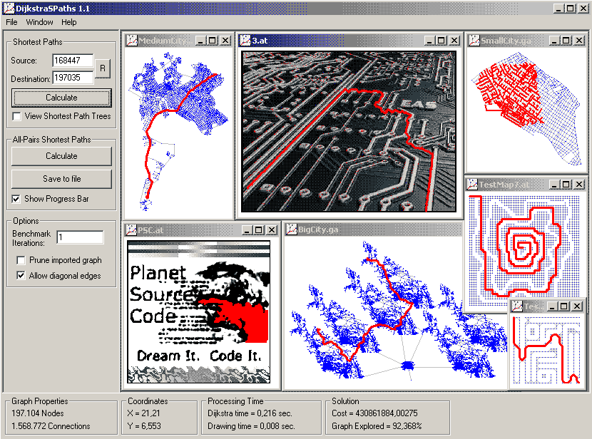

<div align="center">

## Dijkstra PathFinding in Arbitrary Graphs and Raster Images\! \(Update \#1\)


</div>

### Description

This is an efficient implementation of Dijkstra's algorithm using a Linked List and a Priority Queue (Binary Heap). Unlike most other path finding implementations found in PSC, this application maintains a topological structure to store and navigate through the graphs. Can import user defined graphs, tile maps and images.

Several test instances are included, all wrapped up in a cool application! Useful for Vehicle Routing, Vector and Raster GIS Applications, AI Path Finding and more. Any comments / suggestions would be really appreciated!
 
### More Info
 


<span>             |<span>
---                |---
**Submitted On**   |2005-04-20 20:15:46
**By**             |[ Stavros](https://github.com/Planet-Source-Code/PSCIndex/blob/master/ByAuthor/stavros.md)
**Level**          |Intermediate
**User Rating**    |5.0 (104 globes from 21 users)
**Compatibility**  |VB 6\.0
**Category**       |[Data Structures](https://github.com/Planet-Source-Code/PSCIndex/blob/master/ByCategory/data-structures__1-33.md)
**World**          |[Visual Basic](https://github.com/Planet-Source-Code/PSCIndex/blob/master/ByWorld/visual-basic.md)
**Archive File**   |[Dijkstra\_P1882594302005\.zip](https://github.com/Planet-Source-Code/stavros-dijkstra-pathfinding-in-arbitrary-graphs-and-raster-images-update-1__1-59974/archive/master.zip)

### API Declarations

```
'//Update #1 (2005/16/04)
'
'-Import your own BMP, JPG, GIF images!
'-Fixed extreme memory utilization when pruning a graph.
'-Fixed progress bar behaviour when benchmarking a random graph.
'-Fixed .at loading glitches.
'-Fixed error when .ga files had no coordinates.
'-Fixed some file I/O errors.
' Download size: 221 KB
```


